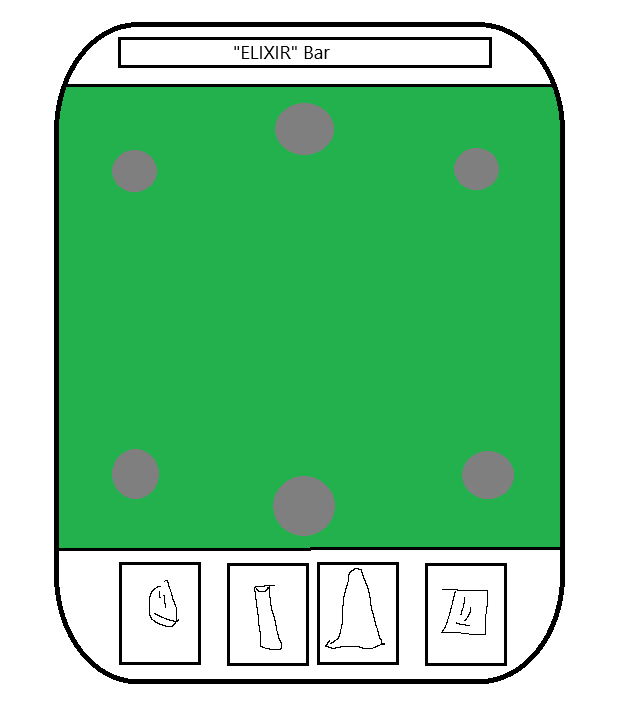
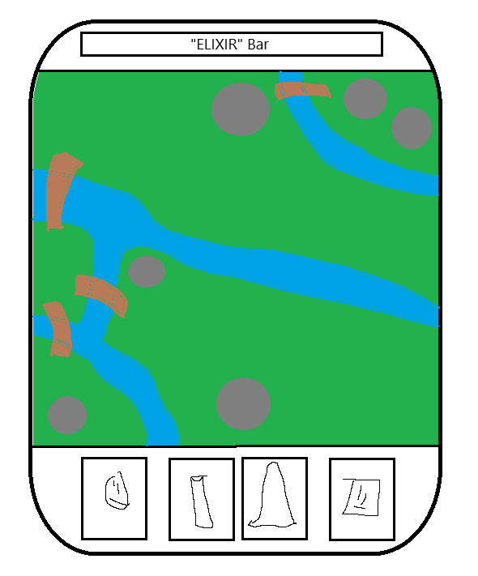
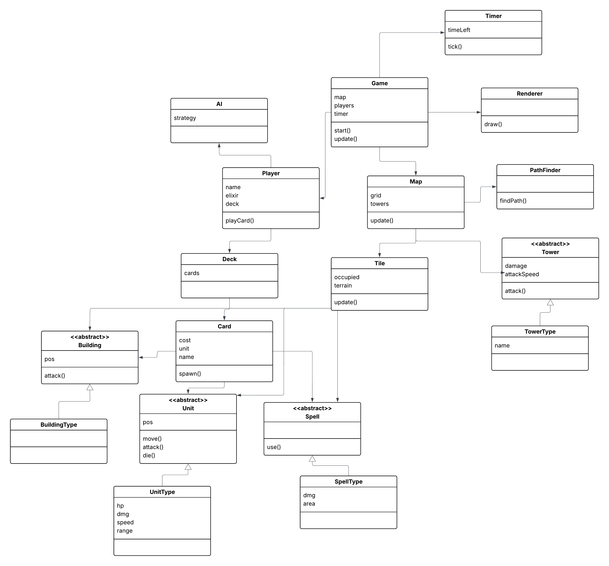

# Project plan

**The Game**

Our project is a Clash Royale-ish type of strategy game. The game will work something like the following.

You gain “elixir” (should probably call it something else) just by waiting. With elixir you can "activate" cards that spawn entities on the battlefield. The entities will then march toward the enemy encampment (towers, etc). If they meet enemies they will begin attacking. Troops will have a simple AI: they will attack the first thing that they see until it dies. Every entity has their strengths and weaknesses (also different kinds of attacks such as splash damage, air attacks etc). The player can also use spells that have different effects of the map/troops/towers.

Both players have one main “king” tower. The player who destroys their opponent's king tower first will win unless time runs out, in which case the player who has destroyed more other towers or done more damage wins. Players can choose a certain amount of cards to be included in their decks before the game begins. Players can also choose which kinds of defensive towers they have. 

The battlefield will be a simple 2D map. The players can see the map all at once. The map could include different obstacles etc if we see the need to. The map could also be randomly generated at the start of each game if needed to meet the requirements. The players can only place units on their own area (own side maybe).

The players’ cards will cycle their chosen deck (queue data structure). Meaning that they can only have a few cards “in their hand” at any point in the game. 

By default the other player will be an AI implemented by us, but the goal is to include multiplayer.

Early illustration of the game.

What a randomly generated map could look like.

 
 

**The high-level structure of the software (according to current understanding)**

Our application will start from the initializing int main function. The main function will contain the game loop which will run every frame. In the game loop we will include the game itself. This means graphics, logic, sound, networking(?). 

The cards will follow the following structure: There will be one abstract parent class for a card class. Every specialized card will inherit this class and make changes to its logic and appearance. The parent classes for two main types of cards, units and spells house functionalities of interacting with the game, meanwhile subclasses house parameters and more specialized attributes.

The towers follow the same kind of structure: There will be one abstract parent class of a tower that the others will inherit. The child classes can have different amounts of healthpoints, different ways to defend themselves (e.g. fire- and freeze abilities) and appearance differences.

The map object has containers for all of the buildings, troops etc. on the screen. When the gameloop “ticks” the game progresses: units move/attack and so on and the game is re-rendered.

Further algorithms will be designed down the road.

Very raw UML chart that is subject to change:

 
 

**Libraries**

SFML for graphics and sounds

 
 

**Sprints**

Sprint 0: (29.9. - 13.10.)
Plan document

Sprint 1: (14.10. - 24.10.)
CMake config
Header files with class declarations
One meet at the start of sprint to share responsibilities
Other “daily” meets when needed

Sprint 2: (25.10. - 7.11.)
Working prototype
One meet at the start of sprint to share responsibilities
Other “daily” meets when needed

Sprint 3: (8.11. - 21.11.)
Fully functioning and playable game
All main features complete
One meet at the start of sprint to share responsibilities
Other “daily” meets when needed

Sprint 4: (22.11. - 5.12.)
Finished product
Project documentation ready
